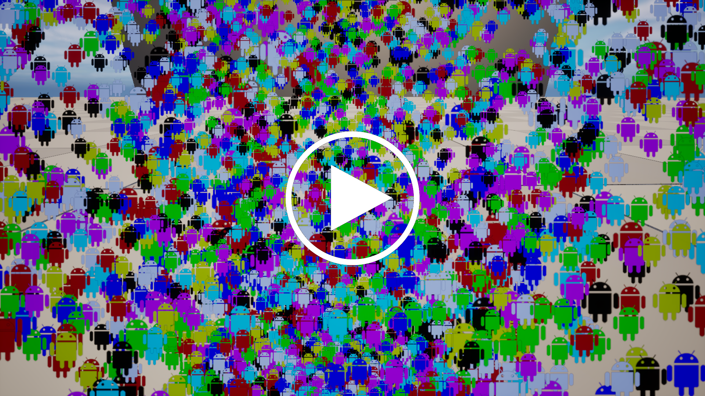
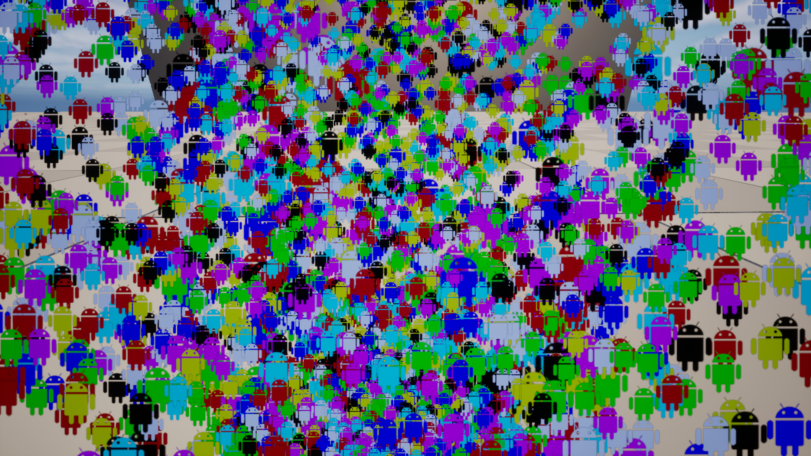
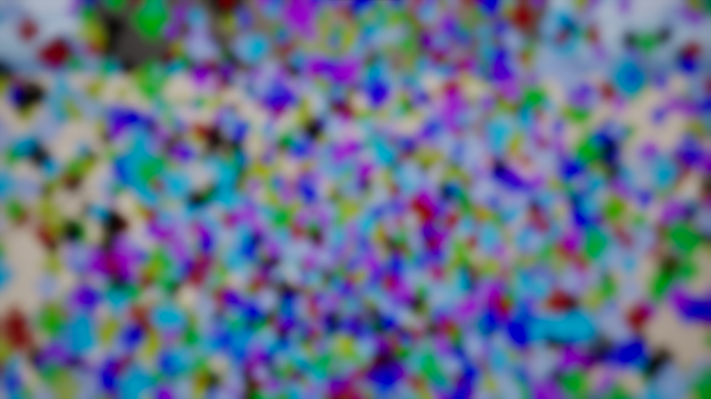
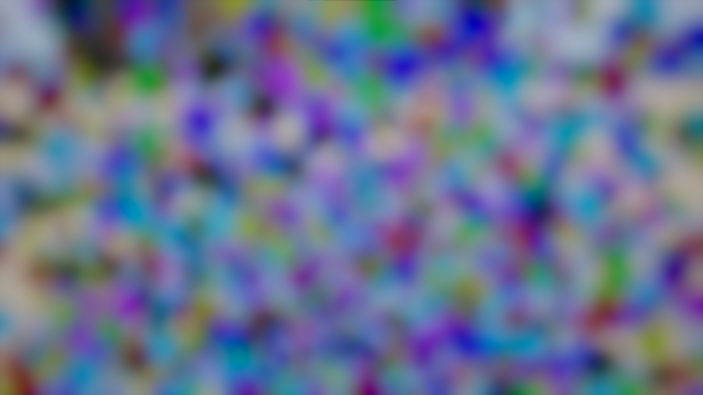
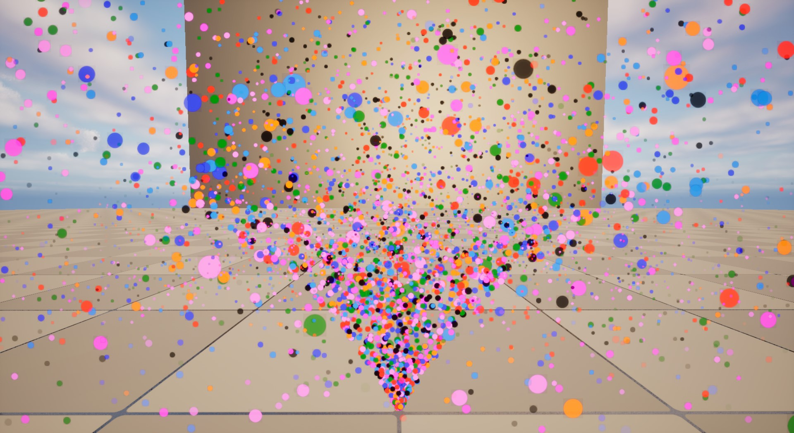
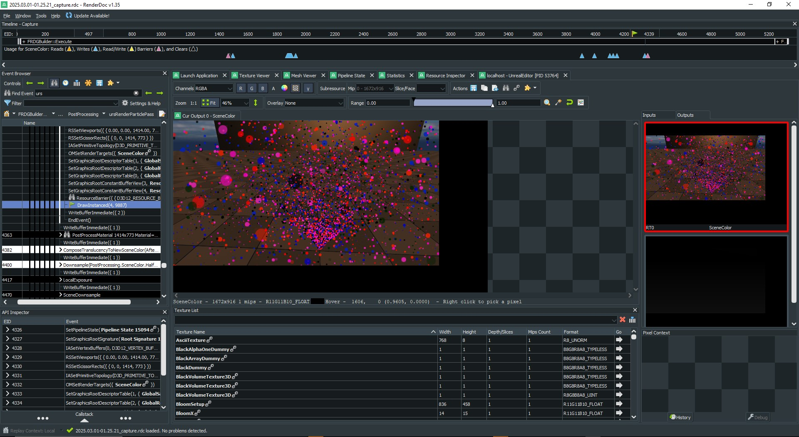
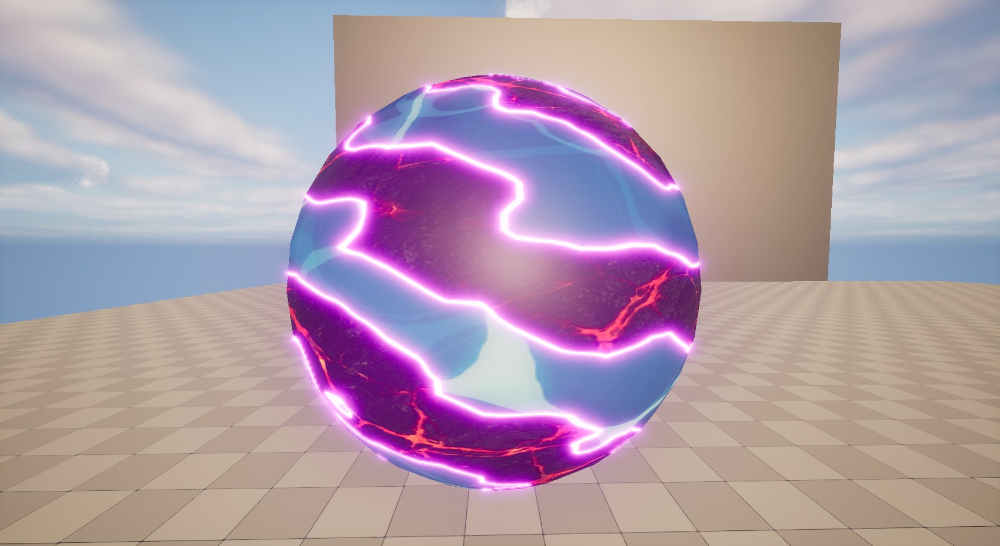
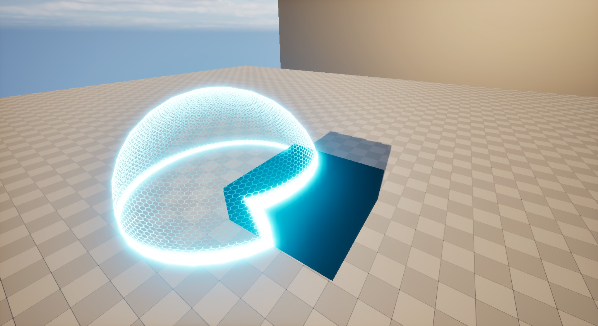
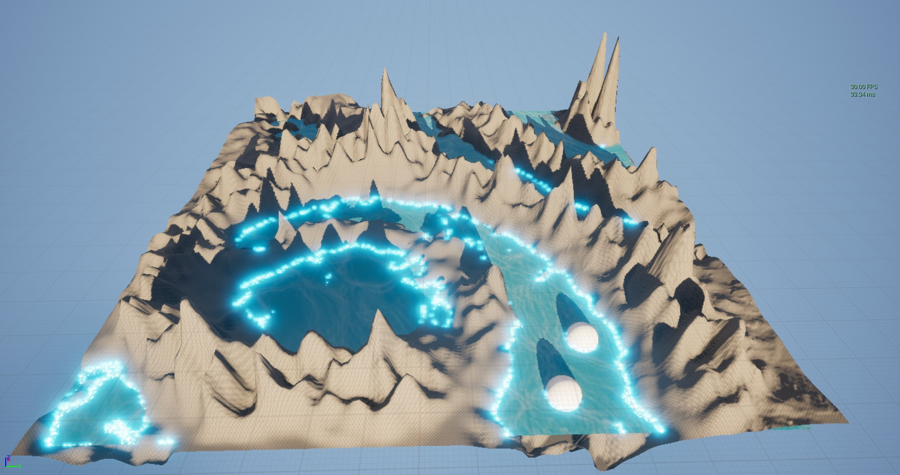
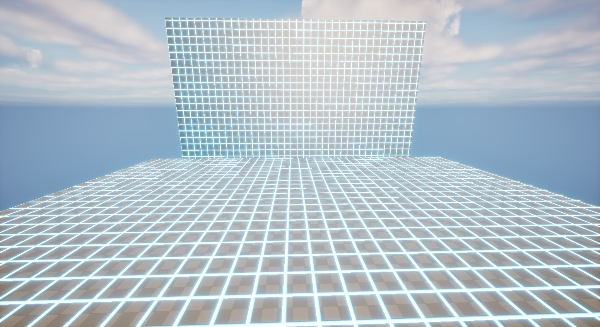

# unrealsi1
unrealsi1 is a Unreal technical demo, currently focus on the rendering part.

## Demo video

**Table of Contents**
- Demos
- Features
- Technical Highlights
- Roadmap
- Requirement
- Build
- How to play
- References

## Requirement

- Unreal 5.4.4
- Visual Studio 2022

## Demos

### Render Features (C++ only, RDG, HLSL)

- ## Dual Kawase Blur ([performance detail](doc/detail/render/feature/post_processing/dual_kawase_blur/dual_kawase_blur.md)) 
  2x speedup compare to unreal blur impl

  | original | 3 + 3 down/up sample | 4 + 4 down/up sample |
  |---|---|---|
  ||||

- ## Simple Particle System

  | particles collision | debug with RenderDoc |
  |---|---|
  |||

### Material Vfx (HLSL)

| dissovle | force field | simple water |
|---|---|---|
|||
| world scanner | --- | --- |
|

## Features

- full HLSL integration for unreal material workflow (wip)
- unreal plugin and module examples

## Technical Highlights

- custom rendering pass by using Render Dependency Graph (RDG) and Compute Shader
- personal HLSL library by using unreal HLSL library instead of material nodes

## Build

- open unrealsi1/unrealsi1.uproject

## How to play

- open unrealsi1/demo/test/render/feature for RDG feature
- open unrealsi1/demo/test/render/materual/vfx for material vfx

## Roadmap

please go to [roadmap](doc/detail/roadmap.md)

## References

please go to [reference](doc/reference/reference.md)