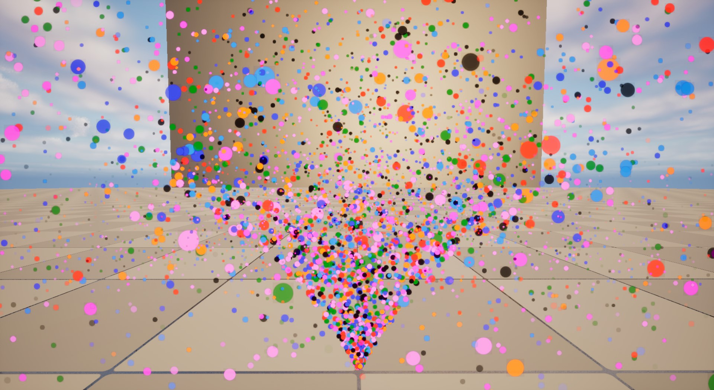
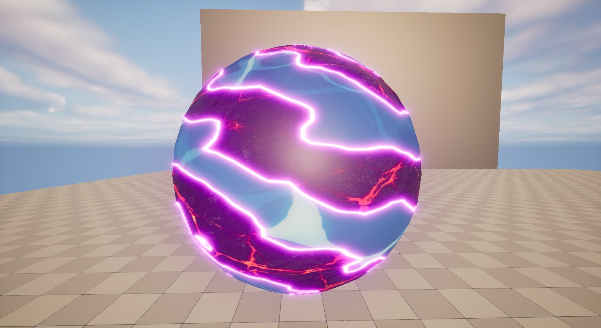
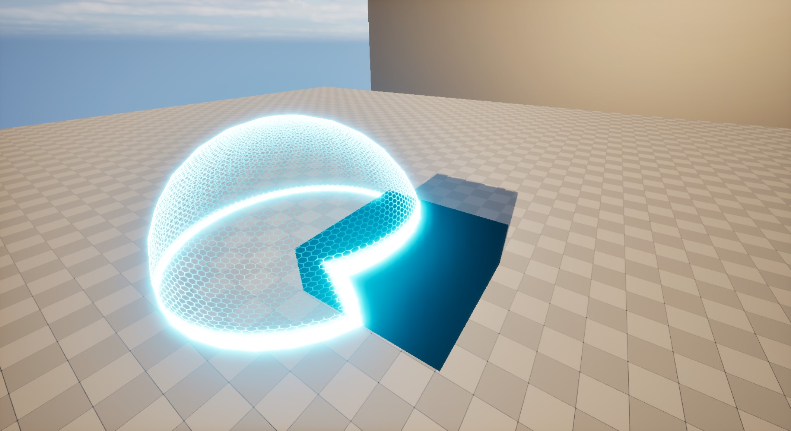
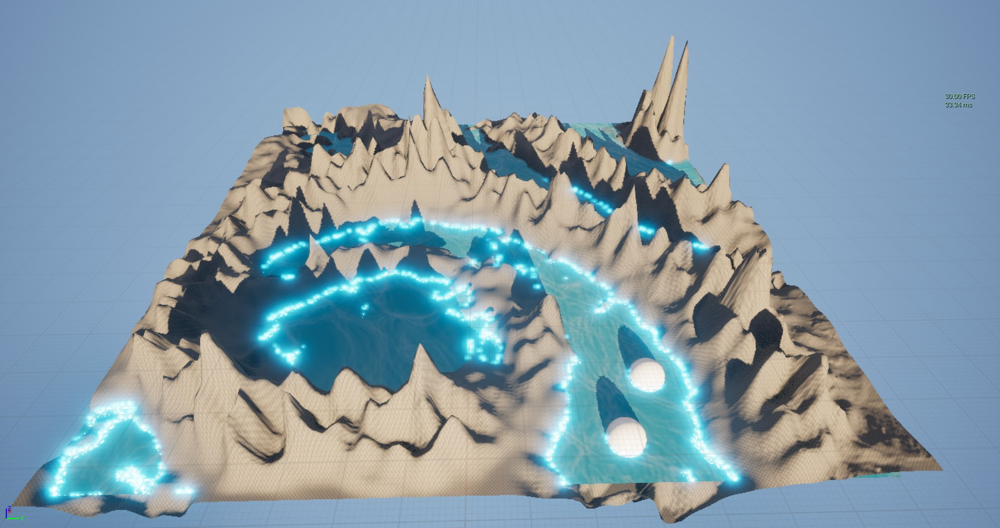
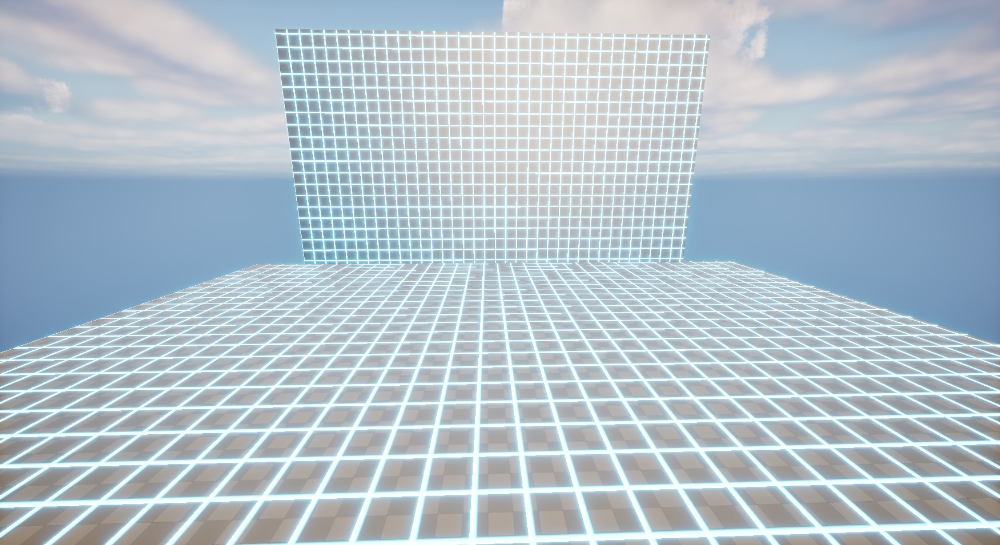

# unrealsi1
unrealsi1 is a Unreal technical demo, currently focus on the rendering part. \
Also providing examples to use Unreal properly.

demo video:\

\
**Table of Contents**
- Demos
- Features
- Technical Highlights
- Roadmap
- Requirement
- Build
- Usage
- References

## Requirement

- Unreal 5.4.4
- Visual Studio 2022

## Demos

### Material Vfx (HLSL)

| dissovle | force field | simple water |
|---|---|---|
|||
| world scanner | --- | --- |
|

### Simple Particle System (Render Dependency Graph + Compute Shader)
| particles collision | debug with RenderDoc |
|---|---|
|||

## Features

- full HLSL integration for unreal material workflow (wip)
- unreal plugin and module examples

## Technical Highlights

- custom rendering pass by using Render Dependency Graph(RDG) and Compute Shader
- personal HLSL library by using unreal HLSL library instead of material nodes

## Roadmap

- rendering
  - anti-aliasing for procedure texture
  - more vfx
  - custom mesh pass, vertex factory

- tool
  - full hlsl integration for unreal material workflow
    - [ ] parse hlsl file
    - [ ] generate parameters for material
    - [ ] monitor file changes

- gameplay
	- simple character battle gameplay
		- [ ] character animation
		- [ ] damage system
		- [ ] ai behaviour

## Build

- open unrealsi1/unrealsi1.uproject

## Usage

- open unrealsi1/demo/test/vfx for material vfx
- open unrealsi1/demo/test/shader/vfx for shader vfx

## References

please go to [reference](doc/reference/reference.md)