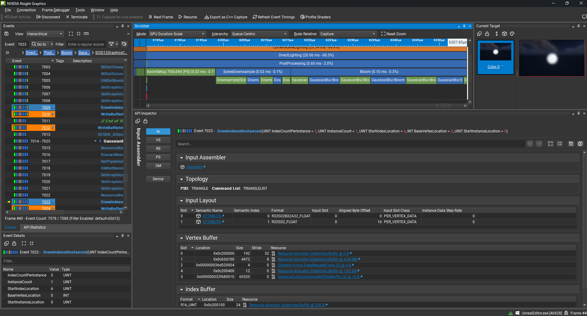
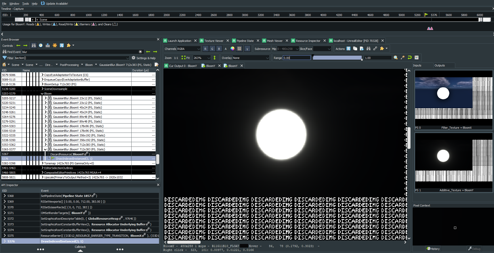
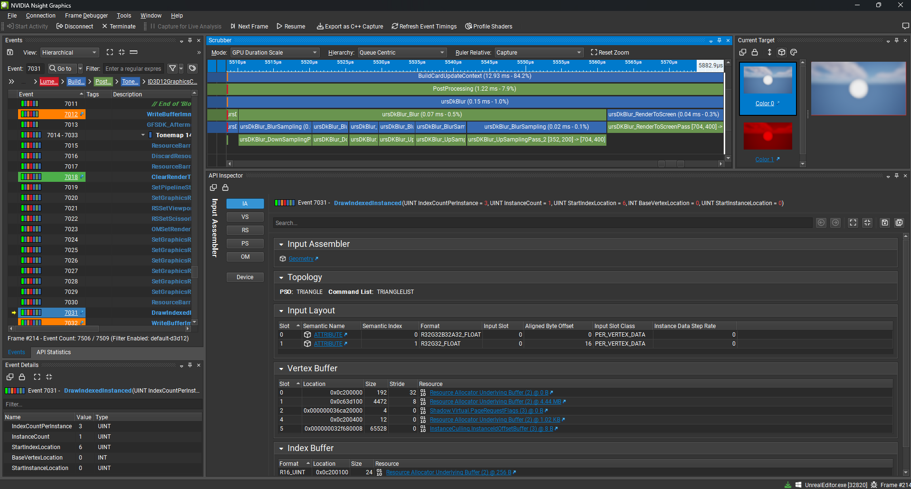
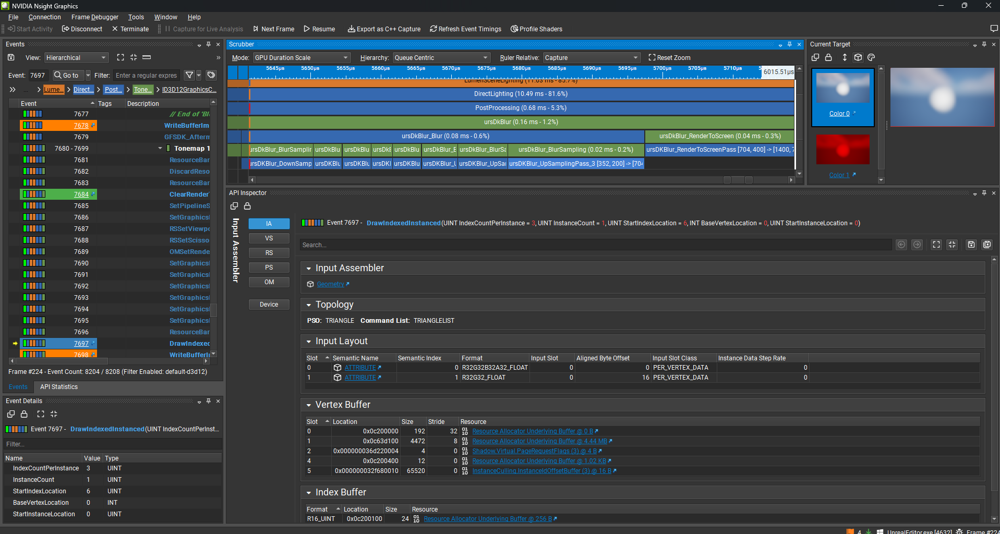

# Dual Kawase Blur
- n + n down/up sampling blur passes
- 2x speedup compare to unreal blur impl
- faster for bloom if up-sample until 1/2 resolution, total n + (n - 1) passes

### unreal impl

- half resolution as input then down-sample (1/2, 1/4, ..., 1/64) -> up-sample gaussian blur x,y

## Rough performance comparison
- Environment
  - CPU: AMD Ryzen 7 3700X
  - GPU: NVIDIA GeForce RTX 3060

- Profile with Nsight
- Development Editor Build (Shipping build need build from unreal source code with bAllowProfileGPUInShipping)

- Input: half resolution scene color texture

- Not same output texture since unreal do not expose the blur api

### unreal guassian blur
- toal passes: 18 (5 down sampling + 1 setup + 6 * 2 up gaussian x, y sampling passes)
- result: used 0.14ms (0.02ms + 0.02ms + 0.10ms)
    | profile | output |
    |---|---| 
    |||

### dual kawase blur
- toal passes: 6 / 8 (3 + 3 or 4 + 4 down/up sampling passes)
- 3 + 3 passes result: used 0.07ms (2x speedup)
    | profile | output |
    |---|---| 
    |||

- 4 + 4 passes result: used 0.08ms (1.75x speedup)
    | profile | output |
    |---|---| 
    |||
